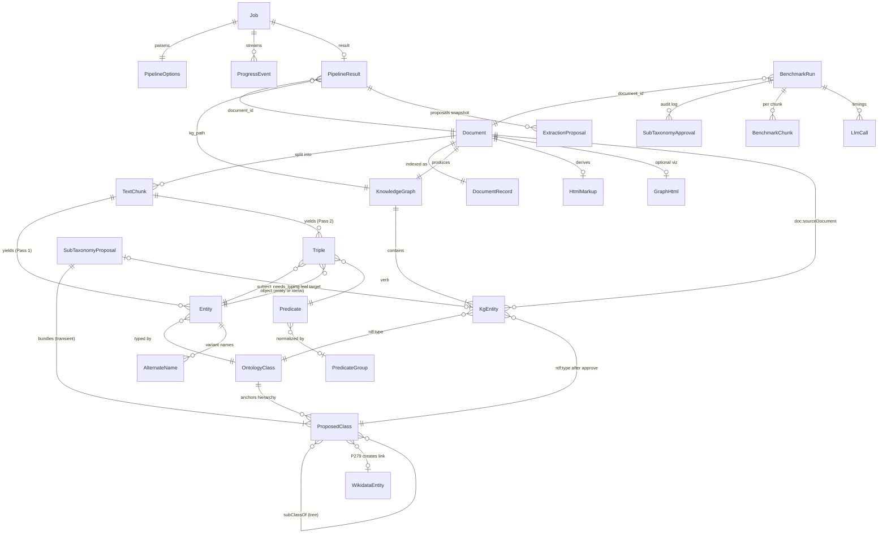
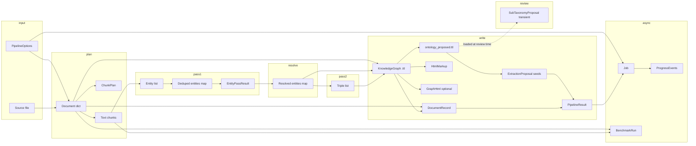
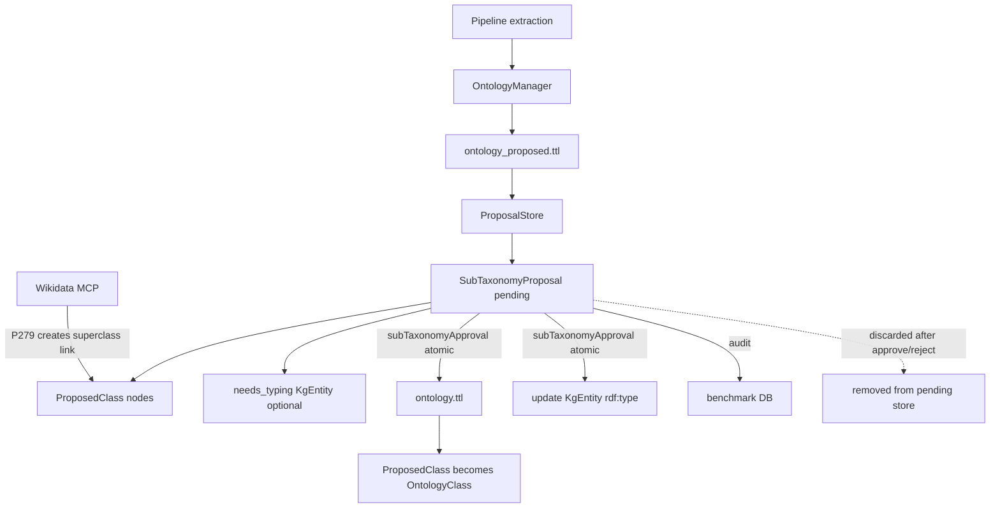

# Internal Information Model

This document describes the **domain information structures** used inside the knowledge-graph pipeline: what flows through extraction, resolution, ontology review, and job orchestration, and how those shapes surface in the HTTP API, CLI, and GUI.

It is the reference for **in-memory** structure changes. Persistent file formats (TTL, `metadata.json`, DuckDB) are noted where they mirror or serialize the same concepts.

**Contents:** [Terminology](#terminology-do-not-conflate) · [Architecture layers](#architecture-layers) · [**Schema: interconnections**](#schema-how-objects-connect) · [Extraction domain](#1-extraction-domain-core-mostly-untyped-dict) · [Pipeline](#2-pipeline-orchestration) · [Jobs](#3-jobs) · [Documents](#4-documents-and-artifacts) · [Ontology review / SubTaxonomyProposal](#5-ontology-review) · [Normalize](#6-predicate-normalization) · [Ops](#7-health-config-benchmark-archive) · [Change checklist](#8-cross-layer-mapping-change-checklist)

---

## Terminology (do not conflate)

| Term | Meaning | Where it lives |
|------|---------|----------------|
| **Information model** | Domain objects: entities, triples, documents, ontology proposals, jobs, progress | This document; mostly plain `dict` lists in `src/extraction/`, `src/ontology/`, `src/services/` |
| **LLM model config** | Provider, model name, chunk sizes, temperature | `config/config.yaml`, `src/config/settings.py` (`LLMSettings`, `ModelOverrides`) |
| **Service DTOs** | Typed wrappers for service inputs/outputs (not core domain) | `src/services/models.py` (`PipelineResult`, `PrecheckResult`, …) |
| **API schemas** | HTTP request/validation subset | `src/api/schemas.py` (Pydantic) |
| **GUI types** | TypeScript mirror of API JSON | `gui/src/api/types.ts` |

When changing the information model, update structures **bottom-up**: domain dicts/dataclasses → services → API JSON → CLI formatters → GUI types.

---

## Architecture layers

```
┌─────────────────────────────────────────────────────────────┐
│  GUI (gui/src/api/types.ts)    CLI (src/cli/formatters.py)  │
└────────────────────────────┬────────────────────────────────┘
                             │ JSON / printed summaries
┌────────────────────────────▼────────────────────────────────┐
│  HTTP API  /api/v1/*  (src/api/routes/, src/api/schemas.py) │
└────────────────────────────┬────────────────────────────────┘
                             │ dataclasses + dicts
┌────────────────────────────▼────────────────────────────────┐
│  Service layer  (src/services/*.py)                         │
└────────────────────────────┬────────────────────────────────┘
                             │ dicts, RDF graphs, files
┌────────────────────────────▼────────────────────────────────┐
│  Core pipeline  extraction · ontology · storage · normalize   │
│  (src/extraction/, src/ontology/, src/storage/, …)           │
└─────────────────────────────────────────────────────────────┘
```

Related design docs: [GUI_API_PLAN.md](./GUI_API_PLAN.md), [ONTOLOGY.md](./ONTOLOGY.md), [Benchmark.md](./Benchmark.md). Reasoning is a separate bounded context — see [CONTEXT-MAP.md](../CONTEXT-MAP.md) and [reasoning/docs/](../reasoning/docs/).

---

## Schema: how objects connect

This section is the **conceptual schema** of the information model: which objects reference which others, how identity is shared across layers, and how in-memory structures map to persisted files. It is not the OWL file (`ontology.ttl`) — see [ONTOLOGY.md](./ONTOLOGY.md) for that.

### Identity keys

| Object | Primary key | Shared across |
|--------|-------------|---------------|
| **Document** | `document_id` = `Path(filename).stem` | metadata.json, KG filename, artifacts, benchmark |
| **Entity** (in-memory) | canonical `entity` string | triple subject/object, dedup map key |
| **Entity** (RDF) | `kg:` URI from normalized name | TTL, re-typing proposals (`entity_uri`) |
| **Ontology class** | label → `ont:` URI | entity `type`, class proposals, OWL hierarchy |
| **Triple** (in-memory) | `(subject, predicate, object)` | merged set during extraction |
| **Job** | UUID `id` | progress events, API polling |
| **Benchmark run** | UUID `run_id` | DuckDB child tables (chunks, llm_calls, …) |
| **SubTaxonomyProposal** | UUID `id` | Transient; review API; logged to benchmark on approval |
| **ProposedClass** | `uri` (`ont:…`) | Nodes inside a SubTaxonomyProposal; merged into ontology on approve |
| **Predicate group** | `canonical` string | `predicate_map.yaml`, normalize API |

### Conceptual entity-relationship diagram



### Pipeline data flow (lifecycle)

Objects appear in this order during `pipeline.process`. Arrows show **produces / references**, not call stack.



### Relationship catalog

| From | To | Cardinality | Link field / mechanism | Notes |
|------|----|-------------|------------------------|-------|
| **Document** | **TextChunk** | 1:N | `ChunkPlan.chunks` | Sized by LLM `chunk_size` / `overlap` |
| **Document** | **DocumentRecord** | 1:1 | `document_id` | `metadata.json` → `documents[id]` |
| **Document** | **KnowledgeGraph** | 1:1 | `{document_id}.ttl` | `PipelineResult.kg_path` |
| **Document** | **HtmlMarkup** | 1:1 | `{stem}_markup.html` | Generated from TTL + source text |
| **Document** | **GraphHtml** | 1:0..1 | `{stem}_graph.html` | Only when `with_graph=true` |
| **Entity** | **OntologyClass** | N:1 | `entity.type` → class label | Unknown types seed **SubTaxonomyProposal** |
| **Entity** | **AlternateName** | 1:N | `alternate_names[]` | From dedup/resolution; written as `kg:alternateName` |
| **Triple** | **Entity** (subject) | N:1 | `triple.subject` | Normalized to canonical name before merge |
| **Triple** | **Entity** (object) | N:1 | `triple.object` | Literal object if not in entity set |
| **Triple** | **Predicate** | N:1 | `triple.predicate` | Optional `scope`, `strength` → n-ary RDF |
| **PredicateGroup** | **Predicate** | 1:N | `variants[]` → `canonical` | `normalize/apply` rewrites TTL predicates |
| **KnowledgeGraph** | **KgEntity** | 1:N | RDF triples in `.ttl` | URI: `kg:{normalized_name}` |
| **KgEntity** | **OntologyClass** | N:1 | `rdf:type` → `ont:` URI | From entity typing or is-a triples |
| **KgEntity** | **Document** | N:1 | `doc:sourceDocument` | Provenance on every written entity |
| **SubTaxonomyProposal** | **ProposedClass** | 1:N | `proposed_classes[]` | Transient bundle; **never** in approved ontology |
| **ProposedClass** | **ProposedClass** | N:M | `subclass_of[]` / `isSuperClassOf` | Small tree; multiple inheritance allowed |
| **ProposedClass** | **OntologyClass** | N:M | terminal `subclass_of` → existing `ont:` URI | Any approved class may anchor the tree |
| **ProposedClass** | **OntologyClass** | N:0..1 | new root on approve | If no existing anchor, becomes new top-level class |
| **SubTaxonomyProposal** | **KgEntity** | 0..1 | `entity_uri` | `needs_typing`: leaf class becomes entity's `rdf:type` |
| **KgEntity** | **ProposedClass** (leaf) | N:1 | after **subTaxonomyApproval** | Entity retyped from `ont:Other` to leaf class |
| **WikidataEntity** | **ProposedClass** link | — | P279 selection | Choosing Wikidata parent **creates** superclass edge |
| **SubTaxonomyApproval** | **SubTaxonomyProposal** | 1:1 | benchmark audit row | Logged on approve/reject; proposal then discarded |
| **Job** | **PipelineOptions** | 1:1 | `Job.params` | Same fields as `PipelineRequest` |
| **Job** | **ProgressEvent** | 1:N | `job_id` | Ring buffer; SSE to GUI |
| **Job** | **PipelineResult** | 1:0..1 | `Job.result` | Set on `succeeded` |
| **BenchmarkRun** | **Document** | N:1 | `document_id`, `document_filename` | One run per pipeline invocation |
| **BenchmarkRun** | **TextChunk** | 1:N | `chunk_number` | Metrics per chunk in DuckDB |
| **PipelineResult** | **ExtractionProposal** | 1:N | `proposals[]` | Pipeline-time summary only; not review bundles |
| **ExtractionProposal** | **ProposedClass** (in TTL) | N:1 | written to `ontology_proposed.ttl` | Persisted seeds; no SubTaxonomyProposal wrapper yet |
| **ontology_proposed.ttl** | **SubTaxonomyProposal** | — | assembled at review load | Transient; exists only during interactive review |

### Pipeline vs review (do not conflate)

| | **ExtractionProposal** (`PipelineResult.proposals`) | **SubTaxonomyProposal** |
|---|-----------------------------------------------------|-------------------------|
| **When** | End of pipeline write pass | During ontology review (CLI/GUI/API) |
| **Lifetime** | Persisted summary + TTL seeds | Transient; discarded after approve/reject |
| **Where** | `PipelineResult`, progress `kind: proposals`, `ontology_proposed.ttl` | Review service only; never in approved ontology |
| **Purpose** | “What did extraction propose?” | “How do we place this in the taxonomy?” |

Review loads pending **ProposedClass** nodes from `ontology_proposed.ttl` and **groups** them into **SubTaxonomyProposal** bundles in memory. The pipeline does not emit SubTaxonomyProposals.

### RDF namespaces (persisted KG)

In-memory **Entity** / **Triple** dicts serialize into Turtle using these namespaces (`src/storage/rdf_utils.py`):

| Prefix | Namespace | Used for |
|--------|-----------|----------|
| `kg:` | `http://example.org/kg/` | Entity URIs, predicates, `alternateName`, qualified relations |
| `doc:` | `http://example.org/doc/` | Document URI, `sourceDocument` provenance |
| `ont:` | `http://example.org/ontology/` | OWL classes (`rdf:type` targets) |
| `ont_meta:` | `http://example.org/ontology/meta/` | Review status on proposals (proposed TTL only) |
| `schema:` | `http://schema.org/` | Document metadata (`name`, `url`) |
| `wd:` | `http://www.wikidata.org/entity/` | Wikidata alignment on approved/proposed classes |

**In-memory → RDF mapping (summary):**

```
Entity { entity, type, alternate_names[] }
  →  kg:{name}  rdf:type  ont:{Type} ;
                 kg:alternateName "variant" ;
                 doc:sourceDocument doc:{document_id} .

Triple { subject, predicate, object [, scope, strength] }
  →  kg:{subject}  kg:{predicate}  kg:{object}|"{literal}" ;
                 doc:sourceDocument doc:{document_id} .
  (with scope → reified ont:QualifiedRelation node — see TurtleWriter)

Document metadata dict
  →  doc:{document_id}  schema:name, schema:url, kg:hash ;
                 owl:imports ont: .
```

### Orthogonal concerns (linked but not owned)

These structures **reference** pipeline objects but live in separate stores:

| Concern | Store | Links to |
|---------|-------|----------|
| **Ontology (approved)** | `data/ontology/ontology.ttl` | Entity types, class hierarchy |
| **Ontology (proposed)** | `data/ontology/ontology_proposed.ttl` | Pending **ProposedClass** nodes + review metadata (not SubTaxonomyProposal wrapper) |
| **Predicate map** | `data/predicate_map.yaml` | Predicates across all KGs in a directory |
| **Benchmark metrics** | `data/benchmark.duckdb` | `document_id`, per-chunk stats, **subTaxonomyApproval** audit |
| **Archive snapshot** | `data_save_*/` | Copies of documents, KGs, ontology; paths rewritten |

### Taxonomy inheritance orientation

Diagrams read **top → bottom**: **most specific at the top**, **most general at the bottom**. The leaf (top) is the class an entity will be typed with; bottom nodes anchor into the approved ontology.

```
  ┌─────────────────┐
  │  MCP Server     │  ProposedClass (leaf) ← KgEntity rdf:type after approval
  └────────┬────────┘
           │ rdfs:subClassOf  (isSuperClassOf inverse: parent below is superclass)
  ┌────────▼────────┐
  │  Framework      │  ProposedClass
  └────────┬────────┘
           │ rdfs:subClassOf
  ┌────────▼────────┐
  │  Technology     │  existing OntologyClass (ont:Technology)
  └─────────────────┘
```

Multiple inheritance: a **ProposedClass** may have **several** superclass links (small tree/DAG), each terminating at a **ProposedClass** or an **existing OntologyClass**.

Extraction that proposes both a new type and a separate is-a edge (e.g. `Framework` and `MCP Server ⊂ Framework`) yields **two SubTaxonomyProposals**, linked only if the reviewer merges them during review.

### Review subgraph (ontology API)

Interactive and GUI review operate on **SubTaxonomyProposal** bundles (transient), persisted as **ProposedClass** nodes in the proposal store until approval:



**Lifecycle:** `SubTaxonomyProposal` exists only while pending review. On **subTaxonomyApproval** (approve or reject), the wrapper is discarded. Approved **ProposedClass** nodes and their `rdfs:subClassOf` edges merge into `ontology.ttl`; the wrapper itself never appears in the resulting ontology. Reject removes pending nodes without merge. Both outcomes are logged in the benchmark DB.

---

## 1. Extraction domain (core, mostly untyped `dict`)

These are the central in-memory shapes during pipeline execution. They are **not** yet formal dataclasses; services pass `List[dict]` / `Dict[str, dict]`.

### Entity

Produced by `EntityExtractor`, deduplicated in `PipelineService._dedupe_entities`, optionally merged by `EntityResolver`.

| Field | Type | Required | Notes |
|-------|------|----------|-------|
| `entity` | `str` | yes | Canonical display name |
| `type` | `str` | yes | Ontology class label (e.g. `Person`, `Technology`, `Other`) |
| `context` | `str` | no | Snippet from source text (LLM extraction) |
| `alternate_names` | `list[str]` | no | Added after dedup/resolution |

**Source:** `src/extraction/entity_extractor.py`, `src/services/pipeline.py`, `src/extraction/entity_resolver.py`

**In-memory map:** After dedup, entities are keyed by canonical name: `Dict[str, dict]`.

### Triple (relationship)

Produced by `RelationshipExtractor`; subject/object normalized to canonical entity names before write.

| Field | Type | Required | Notes |
|-------|------|----------|-------|
| `subject` | `str` | yes | Entity name |
| `predicate` | `str` | yes | Canonical verb (see domain predicate list) |
| `object` | `str` | yes | Entity name |
| `scope` | `str` | no | Qualifier context (e.g. product/component) |
| `strength` | `str` | no | e.g. `mandatory`, `optional` |

**Source:** `src/extraction/relationship_extractor.py`, `src/extraction/prompt_builder.py`

**Uniqueness key:** `(subject, predicate, object)` — see `PipelineService._merge_triples`.

### Document (processed)

Output of `DocumentProcessor.process_document`.

| Field | Type | Notes |
|-------|------|-------|
| `path` | `str` | Absolute file path |
| `filename` | `str` | Basename |
| `extension` | `str` | Lowercase suffix |
| `size` | `int` | Bytes |
| `hash` | `str` | SHA-256 of file |
| `text` | `str` | Full extracted text |
| `word_count` | `int` | Word count |

**Source:** `src/document/processor.py`

**Document ID:** `Path(filename).stem` — used as KG filename stem and metadata key.

### ExtractionProposal (pipeline output)

During TTL write, `OntologyManager` collects unknown types and `needs_typing` flags. These are **persisted** to `ontology_proposed.ttl` as **ProposedClass** / meta nodes. The pipeline also returns a flat summary in `PipelineResult.proposals`:

| Field | Type | Notes |
|-------|------|-------|
| `uri` | `str` | Candidate `ont:` URI |
| `label` | `str` | Human-readable class name |
| `sources` | `list[str]` | Provenance strings (chunk/document refs) |

**Source:** `src/storage/ontology_manager.py` → `get_proposals()`  
**Not the same as** `SubTaxonomyProposal` — see [§5 Ontology review](#5-ontology-review).

---

## 2. Pipeline orchestration

### PipelineOptions (service input)

| Field | Type | Default |
|-------|------|---------|
| `file_path` | `str` | — |
| `output_dir` | `str` | `data/knowledge_graphs` |
| `max_chunks` | `int \| None` | `None` |
| `with_graph` | `bool` | `False` |
| `domain` | `str` | `default` |
| `skip_precheck` | `bool` | `False` |

**Source:** `src/services/models.py`  
**API:** `POST /api/v1/jobs/pipeline` body (`PipelineRequest`)

### ChunkPlan (staged plan)

| Field | Type |
|-------|------|
| `document_id` | `str` |
| `filename` | `str` |
| `word_count` | `int` |
| `chunks` | `list[str]` |
| `llm_model` | `str` |

**Source:** `src/services/models.py`, `PipelineService.build_plan`

### EntityPassResult (staged entities)

| Field | Type |
|-------|------|
| `unique_entities` | `Dict[str, dict]` |
| `entities_raw` | `int` |
| `chunk_entity_counts` | `list[int]` |

**Source:** `src/services/models.py`

### PipelineResult (service output)

| Field | Type |
|-------|------|
| `document_id` | `str` |
| `kg_path` | `str` |
| `markup_path` | `str` |
| `graph_path` | `str \| None` |
| `entity_count` | `int` |
| `triple_count` | `int` |
| `proposals` | `list[dict]` | **ExtractionProposal** summary from this run (`uri`, `label`, `sources`) |

**Source:** `src/services/models.py`  
**API:** `Job.result` when `type == "pipeline.process"`  
**GUI:** `PipelineResult.proposals` in `gui/src/api/types.ts`  
**CLI:** `print_pipeline_summary`  
**Note:** Ontology **review** uses `SubTaxonomyProposal` via `/ontology/sub-taxonomy` — not this field.

### ProgressEvent

| Field | Type | Notes |
|-------|------|-------|
| `stage` | `str` | One of `STAGES` in `src/services/progress.py` |
| `job_id` | `str` | Set by `JobProgressReporter` |
| `chunk` | `int \| None` | Current chunk index |
| `total_chunks` | `int \| None` | |
| `message` | `str` | Plain-text line (CLI) |
| `percent` | `float \| None` | Reserved |
| `payload` | `dict` | Structured hints; see below |

**Stages:** `precheck`, `plan`, `entities`, `resolve`, `relationships`, `sections`, `write`, `done`, `error`

**Common `payload.kind` values:** `processing_start`, `domain`, `document_info`, `pass_banner`, `chunk_header`, `section_header`, `extraction_error`, `proposals`, `write_step`, `graph_generation`

**Source:** `src/services/progress.py`  
**API:** SSE `GET /api/v1/jobs/<id>/events`  
**GUI:** `ProgressEvent` interface

---

## 3. Jobs

### Job (in-memory store)

| Field | Type | Notes |
|-------|------|-------|
| `id` | `str` | UUID |
| `type` | `str` | e.g. `pipeline.process` |
| `status` | `str` | `queued`, `running`, `succeeded`, `failed`, `cancelled` |
| `created_at` | `datetime` | ISO in API |
| `started_at` | `datetime \| None` | |
| `finished_at` | `datetime \| None` | |
| `params` | `dict` | Job-specific (pipeline → `PipelineRequest` fields) |
| `result` | `dict \| None` | e.g. `PipelineResult.as_dict()` |
| `error` | `str \| None` | |
| `cancel_requested` | `bool` | Not exposed in `to_dict()` |

**Source:** `src/services/jobs.py`  
**API:**

| Method | Path |
|--------|------|
| GET | `/api/v1/jobs` |
| GET | `/api/v1/jobs/<id>` |
| GET | `/api/v1/jobs/<id>/events` (SSE) |
| POST | `/api/v1/jobs/<id>/cancel` |
| POST | `/api/v1/jobs/pipeline` → `{ job_id }` |

---

## 4. Documents and artifacts

### Document record (metadata store + service enrichment)

Stored under `data/metadata.json` → `documents[<document_id>]`. Fields from processing are merged with timestamps:

| Field | Type | Notes |
|-------|------|-------|
| `path`, `filename`, `extension`, `size`, `hash`, `text`, `word_count` | from `DocumentProcessor` | `text` stored in metadata today |
| `kg_path` | `str \| None` | Path to `.ttl` |
| `processed_at`, `updated_at` | ISO `str` | |

**Service enrichment** (`DocumentService.get_document`):

```json
{
  "id": "<document_id>",
  "...metadata fields...",
  "artifacts": {
    "kg": "<path or null>",
    "markup": "<path or null>",
    "graph": "<path or null>"
  }
}
```

**Source:** `src/storage/metadata_store.py`, `src/services/documents.py`  
**API:**

| Method | Path |
|--------|------|
| GET | `/api/v1/documents` |
| GET | `/api/v1/documents/<id>` |
| POST | `/api/v1/documents/upload` → `{ file_path, filename }` |
| GET | `/api/v1/artifacts/<id>/kg\|markup\|graph` |

**GUI:** `DocumentRecord`

---

## 5. Ontology review

Persistent truth: `data/ontology/ontology.ttl` (approved) and `ontology_proposed.ttl` (differential pending **ProposedClass** nodes). In-memory access via `ProposalStore` (RDF `Graph`).

> **Target model** (below) replaces the legacy flat **ClassProposal** / **needs_typing** split. Implementation still follows the legacy shapes in `proposal_store.py` until migrated.

### SubTaxonomyProposal (transient)

A **bundle for review** — not an OWL class and **never** written to the approved ontology. Discarded after atomic approval or rejection. Logged to the benchmark DB for audit.

| Field | Type | Notes |
|-------|------|-------|
| `id` | `str` | UUID |
| `status` | `str` | `pending`, `approved`, `rejected` |
| `proposed_classes` | `list[ProposedClass]` | Nodes in the taxonomy tree |
| `subclass_links` | `list[SubclassLink]` | Edges between proposed and/or existing classes |
| `leaf_class_uri` | `str` | Top-of-diagram class — entity `rdf:type` target |
| `entity_uri` | `str \| None` | Set for `needs_typing`; KgEntity to retype on approve |
| `source_ttl` | `str \| None` | Originating KG when `entity_uri` is set |
| `proposed_by` | `str` | Document / chunk provenance |
| `created_at` | `str` | ISO timestamp |

**Cardinality rules:**

- Every pending taxonomy review is exactly one `SubTaxonomyProposal`.
- Extraction that introduces both a new type and a separate is-a relationship creates **two** proposals (not one combined).
- Approval is **atomic**: the entire tree is approved or rejected together.

### ProposedClass

A candidate OWL class node inside a SubTaxonomyProposal. On approval, merges into `ontology.ttl` as a permanent **OntologyClass**.

| Field | Type | Notes |
|-------|------|-------|
| `uri` | `str` | `ont:…` candidate URI |
| `label` | `str` | |
| `comment` | `str` | |
| `subclass_of` | `list[str]` | Parent URIs — **ProposedClass** and/or existing **OntologyClass** |
| `equivalent_class` | `list[str]` | Optional Wikidata URIs (`wd:Q…`) |
| `is_new_root` | `bool` | If true and no existing anchor, becomes new top-level class on approve |

**Superclass links** use `rdfs:subClassOf` semantics (child → parent). Internally also referred to as **isSuperClassOf** (parent is superclass of child). **Multiple inheritance** is allowed: several parents per node.

**Wikidata:** selecting a Wikidata parent via review UI/API **creates** the corresponding superclass link (Wikidata **P279** *subclass of*), not merely an alignment annotation.

### SubclassLink

| Field | Type | Notes |
|-------|------|-------|
| `child_uri` | `str` | More specific class (higher in diagram) |
| `parent_uri` | `str` | More general class (lower in diagram) |
| `source` | `str` | `manual`, `llm`, `wikidata_p279`, `extraction`, … |

### needs_typing integration

Replaces the standalone **RetypingProposal** record. A `needs_typing` item **is** a SubTaxonomyProposal with:

- `entity_uri` + `source_ttl` populated (entity currently `rdf:type ont:Other`)
- `leaf_class_uri` = the proposed type for that entity
- On **subTaxonomyApproval** (approve): merge taxonomy **and** update the KgEntity's `rdf:type` to the leaf class

### subTaxonomyApproval

Atomic action (replaces `POST …/approve-chain`):

1. Validate full tree: all terminal edges anchor to existing **OntologyClass** URIs and/or explicit new roots.
2. On **approve**: merge all **ProposedClass** nodes + `rdfs:subClassOf` edges into `ontology.ttl`; retype entity if `entity_uri` set; remove pending proposal.
3. On **reject**: remove pending nodes; no ontology merge.
4. Append audit row to benchmark DB (proposal id, outcome, class URIs, entity_uri, run_id if known).

**Target API** (replaces `approve-chain`):

| Method | Path | Body / notes |
|--------|------|--------------|
| GET | `/api/v1/ontology/sub-taxonomy` | List pending proposals |
| GET | `/api/v1/ontology/sub-taxonomy/<id>` | Full tree |
| PATCH | `/api/v1/ontology/sub-taxonomy/<id>` | Edit links / classes while pending |
| POST | `/api/v1/ontology/sub-taxonomy/<id>/approve` | `{ "action": "approve" \| "reject" }` |
| POST | `/api/v1/ontology/sub-taxonomy/<id>/wikidata-parent` | P279 selection → creates link |

Wikidata search/suggest endpoints remain per leaf or per proposed class node.

### OntologyStatusResult (target)

| Field | Type |
|-------|------|
| `summary` | `dict[str, int]` | Counts: `pending`, `approved`, `rejected`, `needs_typing` |
| `pending` | `list[SubTaxonomyProposal]` | Open taxonomy bundles |
| `needs_typing` | `list[SubTaxonomyProposal]` | Subset where `entity_uri` is set |

### Legacy shapes (current implementation)

Still present in code until migration:

<details>
<summary>Flat Class proposal</summary>

| Field | Type | Notes |
|-------|------|-------|
| `uri` | `str` | Class URI |
| `label` | `str` | |
| `comment` | `str` | |
| `status` | `str` | `pending`, `approved`, `rejected` |
| `proposed_by` | `str` | |
| `subclass_of` | `list[str]` | Parent class URIs |
| `equivalent_class` | `list[str]` | Wikidata URIs |

**Source:** `src/ontology/proposal_store.py` → `_load_class`

</details>

<details>
<summary>Flat RetypingProposal (`needs_typing`)</summary>

| Field | Type | Notes |
|-------|------|-------|
| `node` | `str` | Meta blank-node URI |
| `entity_uri` | `str` | Entity in KG |
| `label` | `str` | |
| `source_ttl` | `str` | Originating KG file |
| `proposed_by` | `str` | |

**Source:** `ProposalStore.get_needs_typing`

</details>

### API (current vs target)

| Method | Path | Status |
|--------|------|--------|
| GET | `/api/v1/ontology/status` | Keep; response shape → SubTaxonomyProposal lists |
| GET | `/api/v1/ontology/proposals?filter=` | **Deprecate** → sub-taxonomy list |
| PATCH | `/api/v1/ontology/proposals/<uri>` | **Deprecate** → sub-taxonomy PATCH |
| POST | `/api/v1/ontology/approve` | Bulk merge; revisit for atomic semantics |
| POST | `/api/v1/ontology/proposals/<uri>/approve-chain` | **Remove** → `sub-taxonomy/<id>/approve` |
| POST | `/api/v1/ontology/proposals/<uri>/suggest-placement` | Keep; operates on ProposedClass node |
| POST | `/api/v1/ontology/proposals/<uri>/wikidata-search` | Keep |

**GUI types (target):** `SubTaxonomyProposal`, `ProposedClass`, `SubclassLink`; retire flat `OntologyProposal` as primary model.

See [ONTOLOGY.md](./ONTOLOGY.md) for approved OWL/Turtle semantics.

---

## 6. Predicate normalization

### Predicate map file (`data/predicate_map.yaml`)

```yaml
mappings:
  - canonical: produces
    variants: [creates, generates]
    reviewed: true
    total_uses: 42
    reason: "..."
```

**Group fields:** `canonical`, `variants`, optional `reviewed`, `total_uses`, `reason`

**Source:** `src/services/normalize.py`, `src/normalization/predicate_normalizer.py`

**API:**

| Method | Path |
|--------|------|
| GET | `/api/v1/normalize/map` |
| PATCH | `/api/v1/normalize/map/groups/<canonical>` |
| POST | `/api/v1/normalize/scan` → `{ map_path, group_count, review_count }` |
| POST | `/api/v1/normalize/apply` → `{ files, triples, dry_run }` |

**GUI:** `PredicateMapping`

---

## 7. Health, config, benchmark, archive

### PrecheckResult

| Field | Type |
|-------|------|
| `ok` | `bool` |
| `checks` | `list[dict]` | Each check: `name`, `ok`, `message`, optional `available`, `skipped`, `hint` |

Check names: `llm_model`, `llm_endpoint`, `embed_model`, `resolution`

**API:** `GET /api/v1/health/precheck`

### ConfigResponse (sanitized, not full `AppSettings`)

Subset of LLM, document chunking, entity resolution, pipeline concurrency, domain list.

**API:** `GET /api/v1/config`

### TableResult (benchmark)

| Field | Type |
|-------|------|
| `columns` | `list[str]` |
| `rows` | `list[list]` |
| `text` | `str` | CLI table rendering |

**API:** `GET /api/v1/benchmark/runs|chunks|llm`, `POST /api/v1/benchmark/query`, `DELETE /api/v1/benchmark`

DuckDB schema: [Benchmark.md](./Benchmark.md)

### ArchiveResult

| Field | Type |
|-------|------|
| `archive_path` | `str` |
| `paths_updated` | `int` |
| `ttl_files_updated` | `int` |

**API:** `POST /api/v1/archive` (see `src/api/routes/archive.py`)

---

## 8. Cross-layer mapping (change checklist)

When you change the **information model**, touch layers in this order:

| Step | Layer | Files |
|------|-------|-------|
| 1 | Domain structure | `src/extraction/`, `src/ontology/`, new `src/domain/` if introducing dataclasses |
| 2 | Services | `src/services/*.py`, `src/services/models.py` (DTOs only) |
| 3 | Tests | `test/test_services_*.py`, extraction tests |
| 4 | API | `src/api/routes/`, `src/api/schemas.py` |
| 5 | CLI | `src/cli/formatters.py`, `main.py` |
| 6 | GUI | `gui/src/api/types.ts`, pages under `gui/src/pages/` |

### Known gaps (intentional today)

- **Entity** and **Triple** are plain dicts — the highest-value future refactor is typed domain objects without changing TTL output.
- **SubTaxonomyProposal** implemented in `src/domain/` and `src/ontology/sub_taxonomy_service.py`; legacy `/ontology/proposals` routes remain as shims.
- **Job.result** and several API responses use `dict` rather than nested Pydantic models.
- **Service DTOs** in `models.py` are not the information model; consider renaming that module (e.g. `service_types.py`) to avoid confusion with LLM model config.

---

## 9. Error envelope (API)

Failed API responses use a consistent shape:

```json
{
  "error": {
    "code": "not_found | bad_request | ...",
    "message": "human-readable detail"
  }
}
```

**Source:** `src/api/errors.py`, individual routes
